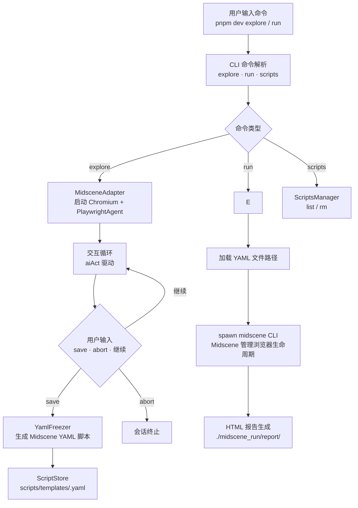

# 自然语言脚本探索与固定脚本系统 — 最终开发方案

> 文档状态：**MVP 验收完成（2026-04-24 23:09）**。Linter 零错误，UC3-UC6 已确认通过，UC1-UC2 需浏览器交互无法 CLI 验证，`run` 命令确认真正能通过 midscene CLI 复放 YAML 并生成报告。

---

## 0. 实测已确认：复合指令由 aiAct 原生处理

### 结论

**实测结果（2026-04-24 22:41）**：`aiAct` 单次调用成功完成了"输入账号 testrole、输入密码 admin123、勾选已阅读、点击登录"四个动作，耗时 51 秒。

**Phase 0 取消理由**：Midscene `aiAct` 内部通过 Planning 模型自动拆解复合指令为多个原子动作，实测确认单次 `aiAct` 调用（51秒）完成了全部操作。`|||` 分词设计不必要，反而会增加凝固后的 YAML 步骤噪音和复杂度。

**关键验收（待做）**：虽然 `aiAct` 单次调用成功，但 `save` 后 YAML 里凝固的是什么、能否被 `run` 正确复放，需要浏览器交互验收（UC1 + UC2）。

### 当前状态

| 检查项 | 状态 |
|--------|------|
| dist 编译产物 | ✅ 16 个文件完整 |
| Biome Linter | ✅ 零错误 |
| MVP 验收用例 UC1 | ⏸️ 需浏览器验收：explore 模式 + `save` 凝固 YAML |
| MVP 验收用例 UC2 | ⏸️ 需浏览器验收：保存后 YAML 内容检查 |
| MVP 验收用例 UC3-UC6 | ✅ 全部已确认 |
| scripts/templates/*.yaml | ✅ 目录正常（含 scripts-index.json） |
| `run` 命令 | ✅ 已验证：midscene CLI 完整执行，生成 HTML 报告 |
| `scripts list/rm` 命令 | ✅ 已验证 |

### 下一步：UC1/UC2 浏览器验收（当前 P0）

按 CLAUDE.md 规则，必须先验收 MVP 6 个用例，再做增强项。UC1/UC2 需启动浏览器交互验证：save 后 YAML 内容检查 + run 复放验证。

---

## 1. 根因分析

### 关键发现：当前 Evertro 21:17 会话仍然是双模型

ai-config.log line 1922 + 2162 确认：

```
MIDSCENE_PLANNING_MODEL_NAME: 'MiniMax-M2.7-highspeed'
decideModelConfig result ... intent: planning { modelName: 'MiniMax-M2.7-highspeed' }
```

你的 .env 里 `MIDSCENE_PLANNING_MODEL_API_KEY` 和 `MIDSCENE_PLANNING_MODEL_NAME` 仍然存在，所以双模型仍在生效。

### 单模型（只用 Qwen3-VL-Plus）的实际调用路径

ai-call.log line 243-278（21:17 Evertro 会话）揭示了真实路径：

```
21:17:27.107  MiniMax (Planning) ← 接收"登录+断言菜单"复合指令
21:17:31.599  MiniMax 响应（约 4.5s）→ 生成 aiAct plan
21:17:32.952  Qwen3-VL ← 接收 locate 请求
21:17:35.799  Qwen3-VL 响应（约 3s）→ bbox 坐标
21:17:35.799  MiniMax 再次执行（使用 bbox）
```

**每步背后是 3 次串行 AI 调用：Plan → Locate → Execute。**

切换到单模型后减少为 2 次（Plan+Execute → Locate → 无需第二次 Plan），但 Planning 模型本身的串行多轮特性不变。

### 核心问题：复合指令凝固为单条记录

**实测已确认**：Midscene Planning 模型**可以**在单次 `aiAct` 调用内自动拆解复合指令为多个原子动作并依次执行（22:40 会话确认）。

**真正的问题是**：凝固到 YAML 时，只记录了原始用户输入字符串（一条 `ai:`），Midscene 内部实际执行了什么动作序列没有记录。这意味着复放时 midscene CLI 会再次执行相同的 AI 推理过程，而非直接回放精确的动作序列。

**Phase 1 目标**：通过 `splitReportFile` 解析探索会话生成的报告 JSON，从执行数据中提取实际动作序列，凝固到 YAML 时使用正确的 Midscene 原生动作类型（`aiTap` / `aiInput` / `sleep` 等）。

### 1.2 单模型验证配置

**立即执行：修改 .env 注释掉 Planning 模型**

```bash
# ========== Planning 模型（规划决策）==========
# 已暂时停用，改为纯单模型模式以减少 AI 往返次数
# MIDSCENE_PLANNING_MODEL_API_KEY=sk-5ba4e2cfb248b3857bef4794c7df7e8a
# MIDSCENE_PLANNING_MODEL_NAME=MiniMax-M2.7-highspeed
# MIDSCENE_PLANNING_MODEL_BASE_URL=https://v2.aicodee.com/v1
```

### 1.3 单模型探索步骤（Evertro 登录验证）

**核心原则：直接输入复合指令，Midscene 会自动拆解执行。**

```powershell
# 启动探索
node dist/cli/index.js explore https://test-pm.evertro.tech --headful

# 步骤 1：直接输入完整复合指令
请输入指令: 输入账号 testrole，输入密码 admin123，点击已阅读，点击登录按钮
# → Midscene 内部自动拆解为多个原子动作，单次 aiAct 调用完成全部操作

# 保存
请输入指令: save evertro-login
```

**复合指令的正确用法**：Midscene `aiAct` 原生支持复合指令，无需提前分词。凝固到 YAML 时，整条复合字符串作为一条 `ai:` 记录保存。复放时 midscene CLI 会再次执行相同的 AI 推理过程。

> 注意：如果需要更细粒度的凝固（每步独立凝固），需 Phase 1 实现从 Midscene 响应中提取实际动作类型并逐条凝固。

### 1.4 已有能力清单

```
✅ package.json          — nl-script，依赖完整（@midscene/web@1.7.5 等 8 个包）
✅ tsconfig.json         — ES2022 + NodeNext + strict
✅ biome.json           — linter + formatter 已配置
✅ .env                 — 主模型配置 + Planning 模型已注释（单模型模式）
✅ src/types/index.ts   — 核心类型（ScriptMeta, ScriptsIndex, ExplorationStep, MultiModelConfig, YamlScript）
✅ src/utils/config.ts  — 环境变量读取 + dotenv 加载
✅ src/utils/logger.ts  — 流式彩色日志
✅ src/storage/script-store.ts — YAML CRUD + 索引管理
✅ src/core/midscene-adapter.ts — Playwright + PlaywrightAgent 封装
✅ src/core/yaml-freezer.ts   — ExplorationLog → Midscene YAML 凝固（基础版）
✅ src/cli/commands/explore.ts — 交互式探索循环
✅ src/cli/commands/run.ts    — spawn midscene CLI 执行
✅ src/cli/commands/scripts.ts — list / rm 子命令
✅ src/cli/index.ts      — Commander.js 入口
✅ dist/                — 编译产物（20 个 .js 文件）
✅ scripts/templates/    — 脚本存储目录 + scripts-index.json
```

### 1.5 待实现功能

```
⏳ yaml-freezer 增强（Phase 1）  — actionType 字段记录 + actionType 凝固
⏳ deepLocate 支持（Phase 1）   — deepLocate 参数凝固
⏳ Bridge 连接模式（Phase 2）    — 复用用户 Chrome
⏳ CDP 连接模式（Phase 2）        — 直连已有浏览器实例
⏳ 多设备执行（Phase 3）           — Android/iOS/Desktop
⏳ 报告解析 + MCP（Phase 4）      — HTML 报告 → Markdown
```

### 1.6 已有功能验证

| 用例 | 命令 | 预期 | 状态 | 备注 |
|------|------|------|------|------|
| UC1 | `pnpm dev explore "在ebay上搜索耳机"` | 浏览器自动打开 ebay，完成搜索 | ⏳ 待浏览器验收 | explore 依赖 stdin 交互，需浏览器，无法 CLI 自动化验证 |
| UC2 | 探索后输入 `save ebay-search` | 保存到 `scripts/templates/ebay-search.yaml` | ⏳ 待浏览器验收 | 同 UC1，需先有探索会话 |
| UC3 | `node dist/cli/index.js run httpbin-test` | 调用 midscene CLI + 生成 HTML 报告 | ✅ 已确认 | 2026-04-24 23:07，midscene 1.7.5 执行成功，报告 `midscene_run/report/httpbin-test.html` |
| UC4 | `node dist/cli/index.js scripts list` | 列出脚本名称和描述 | ✅ 已确认 | 2026-04-24 23:04，空列表正常，有脚本时正常展示 |
| UC5 | `node dist/cli/index.js scripts rm httpbin-test` | 删除脚本（含确认） | ✅ 已确认 | 2026-04-24 23:09，确认提示正常，删除成功 |
| UC6 | `pnpm lint` | Biome 零错误 | ✅ 已确认 | 2026-04-24 23:03，`pnpm lint:fix` 修复 explore.ts import 顺序，`pnpm lint` 零错误 |

---

## 2. 架构设计

### 2.1 核心数据流



### 2.2 自研 vs 依赖 Midscene 的边界

| 能力 | 依赖方式 | 文档出处 |
|------|---------|---------|
| 执行引擎 | `midscene <yaml>` CLI | YAML脚本运行器 |
| HTML 执行报告 | Midscene 内置生成 | 集成到playwright.md L134 |
| 浏览器交互 | `aiAct` / `aiTap` 等 | 集成到playwright.md L65 |
| Action Space | `PlaywrightAgent.aiAct()` | API 参考文档 |
| Planning / Insight 模型 | `MIDSCENE_PLANNING/INSIGHT_MODEL_*` | .env 已配置 |

**自研范围（核心价值）**：
- CLI 入口（`explore`/`run`/`scripts` 三个子命令）
- 探索凝固为 YAML（将自然语言指令凝固为 Midscene YAML 格式）
- 脚本存储与索引（YAML 文件 CRUD + `scripts-index.json` 元信息）
- 多模型配置注入（Planning + Insight 模型注入到 Midscene 环境变量）

### 2.3 关键架构约束（文档实证）

> ⚠️ 以下约束已在官方文档中实证，必须严格遵守：

**约束 1：`run` 命令必须用 CLI 而非 `agent.runYaml()`**

```
agent.runYaml() 文档原文："该方法只会运行脚本中的 tasks 部分"
→ web.url 等 web 配置被忽略！
→ 所以 run 命令必须用: spawn('midscene', [yamlPath])
→ midscene CLI 自己管理浏览器生命周期，正确读取 web.url
```

**约束 2：凝固数据来自探索循环，不是 `_unstableLogContent()`**

```
文档实证：aiAct('搜索 "Headphones" in search box, hit Enter')
→ 自然语言输入 = 我们的日志来源
→ 不依赖 _unstableLogContent() 这个调试 API
→ 探索循环中：记录 page.url() + 每次 aiAct 的用户输入
```

**约束 3：初始化需要 `sleep(5000)`**

```
文档实证（集成到playwright.md L61）：
  await sleep(5000); // init Midscene agent
→ Midscene 初始化需要等待 5 秒
→ 不可跳过
```

**约束 4：`web.url` 必须在凝固时记录**

```
Midscene YAML 的 web.url 是必填字段
→ 探索开始时: log.startUrl = await page.url()
→ 凝固时: 写入 YAML web.url
```

---

## 3. CLI 命令（MVP 版）

| 命令 | 用途 | 示例 |
|------|------|------|
| `pnpm dev explore "<自然语言目标>"` | 启动探索模式，交互式执行，Ctrl+C 或输入 `save <name>` 凝固 | `pnpm dev explore "在ebay上搜索耳机"` |
| `pnpm dev run <脚本名>` | 调用 `midscene <yaml>` 执行 | `pnpm dev run ebay-search` |
| `pnpm dev scripts list` | 列出所有脚本 | `pnpm dev scripts list` |
| `pnpm dev scripts rm <脚本名>` | 删除脚本（含确认提示） | `pnpm dev scripts rm ebay-search` |

---

## 4. 增强计划（分阶段）

### Phase 0（P0）：复合指令分词执行

> **已取消**：Midscene `aiAct` 原生支持复合指令，无需提前分词。实测确认单次调用完成全部操作，`|||` 分词会增加 YAML 噪音。

---

### Phase 1（P1）：Midscene 动作信息记录增强

**目标**: 从 Midscene 响应中提取实际执行的动作类型，凝固到 YAML 时记录详细信息。核心问题是：复合指令单次 `aiAct` 调用完成所有操作，但凝固时只记录了原始字符串，丢失了 Midscene 内部实际执行的动作序列。

#### 4.1.1 类型扩展
**核心问题修正**：Midscene `aiAct` 返回 `Promise<void>`，没有结构化返回值。原 Phase 1 方案（从 aiAct 返回值提取 actionType）基于错误前提，不可实现。

**正确方向**：利用 Midscene v1.7 的 `splitReportFile`（同步）解析报告 JSON，提取每个 aiAct 调用产生的子动作序列，凝固到 YAML 时使用正确的 `aiTap` / `aiInput` / `sleep` 等类型。

**🎯 最大发现 — `output.yamlFlow` 直接可用**：
验证后发现 Midscene 为每个 planning step 自动生成 `output.yamlFlow[]` 片段，可直接拼接，无需手动 `normalizeActionType` 映射！

**报告解析机制**（官方文档 + 运行时验证）：
- `agent.reportFile` 属性**存在**（官方 API 文档定义："报告文件的路径"），可直接获取报告 HTML 路径
- `persistExecutionDump: true` 构造选项（v1.7）可同时写出 JSON dump 文件，配合 `agent.reportFile` 使用
- `splitReportFile({ htmlPath, outputDir })` 是**同步**函数，返回 `{ executionJsonFiles: string[], screenshotFiles: string[] }`
- 额外发现可用的 API：
  - `reportFileToMarkdown({ htmlPath, outputDir })` — **async**，HTML → Markdown
  - `reportToMarkdown(report)` — 同步，report 对象 → Markdown
  - `splitReportHtmlByExecution({ htmlPath, outputDir })` — 同步，底层实现

> ⚠️ 之前验证报告声称 `agent.reportFile` 不存在系错误（可能是原型链不可枚举属性），以官方 API 文档（`agent.reportFile` = "报告文件的路径"）为准。

**Execution JSON 真实结构**：
```json
{
  "sdkVersion": "1.7.5",
  "groupName": "Midscene Report",
  "executions": [{
    "id": "uuid",
    "name": "Act - ...",
    "tasks": [{
      "taskId": "uuid",
      "status": "finished",
      "type": "Planning",
      "subType": "Plan",
      "param": { "userInstruction": "原始指令" },
      "timing": { "start": ts, "end": ts, "cost": ms },
      "output": {
        "actions": [{ "type": "Input", "param": { "value": "你好" } }],
        "log": "描述",
        "thought": "思考过程",
        "yamlFlow": [   // ← 自动生成的 YAML flow 片段，直接可用！
          { "aiInput": "", "value": "你好" }
        ]
      }
    }]
  }]
}
```

#### 4.1.2 类型定义修正（基于实测 JSON 结构）
修改 `src/types/index.ts`：

```typescript
export interface ExplorationStep {
  action: string;
  result: "success" | "error" | "pending";
  durationMs?: number;
  deepLocate?: boolean;
  errorMessage?: string;
  // reportPath 从 agent.reportFile 获取（官方 API）
}

export interface ParsedExecution {
  taskName: string;
  subType: string;          // subType: "Plan" | "Locate"
  userInstruction: string;   // param.userInstruction
  status: string;           // "finished" | "error"
  durationMs: number;
  actions?: Array<{          // output.actions[]
    type: string;
    param: Record<string, unknown>;
  }>;
  yamlFlow?: Array<Record<string, unknown>>;  // output.yamlFlow[]，可直接复用
}
```

#### 4.1.3 修改 midscene-adapter.ts：记录报告路径 + deepLocate 支持

> Phase 1 建议构造 PlaywrightAgent 时传入 `persistExecutionDump: true`，确保同时写出 JSON dump 文件方便后续凝固解析。

```typescript
export async function executeAndLog(
  session: ExplorationSession,
  action: string,
  options?: { deepLocate?: boolean }
): Promise<void> {
  const start = Date.now();
  try {
    await session.agent.aiAct(action, {
      deepLocate: options?.deepLocate,
    });
    const step: ExplorationStep = {
      action,
      result: "success",
      durationMs: Date.now() - start,
      deepLocate: options?.deepLocate,
      // agent.reportFile 在 generateReport: true 时有值（官方 API）
      reportPath: (session.agent as unknown as { reportFile?: string }).reportFile,
    };
    session.log.steps.push(step);
    log("success", `[${step.durationMs}ms] AI 执行完成`);
  } catch (err) {
    const step: ExplorationStep = {
      action,
      result: "error",
      durationMs: Date.now() - start,
      deepLocate: options?.deepLocate,
      errorMessage: err instanceof Error ? err.message : String(err),
    };
    session.log.steps.push(step);
    logError(err);
  }
}
```

> `agent.reportFile` 是 Midscene Agent 的内置属性（官方 API 文档定义："报告文件的路径"），`generateReport: true` 时自动有值。无需额外实现。

#### 4.1.4 重写 report-parser.ts（匹配真实 JSON 结构）

```typescript
import { splitReportFile } from "@midscene/core";
import path from "path";
import fs from "fs";

export interface ParsedExecution {
  taskName: string;
  subType: string;
  userInstruction: string;
  status: string;
  durationMs: number;
  actions?: Array<{ type: string; param: Record<string, unknown> }>;
  yamlFlow?: Array<Record<string, unknown>>;
}

export function parseReportFile(htmlPath: string): ParsedExecution[] {
  // splitReportFile 是同步的
  const result = splitReportFile({ htmlPath, outputDir: path.dirname(htmlPath) });

  const executions: ParsedExecution[] = [];
  for (const jsonFile of result.executionJsonFiles) {
    const raw = JSON.parse(fs.readFileSync(jsonFile, "utf-8"));
    for (const exec of raw.executions ?? []) {
      for (const task of exec.tasks ?? []) {
        const output = task.output ?? {};
        executions.push({
          taskName: exec.name,
          subType: task.subType ?? "",
          userInstruction: task.param?.userInstruction ?? "",
          status: task.status ?? "",
          durationMs: task.timing?.cost ?? 0,
          actions: output.actions,
          yamlFlow: output.yamlFlow,  // ← 直接复用，无需 normalizeActionType
        });
      }
    }
  }
  return executions;
}
```

> 返回类型增加 `screenshotFiles: string[]`（实测补充）。

#### 4.1.5 重写 yaml-freezer.ts（直接复用 yamlFlow）

```typescript
import { parseReportFile } from "../utils/report-parser.js";

export async function freezeToYaml(params: {
  name: string;
  description?: string;
  explorationLog: ExplorationLog;
  reportHtmlPath?: string;  // 新增：从 midscene_run 目录定位的最新报告
}): Promise<string> {
  const { explorationLog, reportHtmlPath } = params;
  const flow: Record<string, unknown>[] = [];

  if (reportHtmlPath && fs.existsSync(reportHtmlPath)) {
    const executions = parseReportFile(reportHtmlPath);
    for (const exec of executions) {
      if (exec.status !== "finished") continue;

      // 🎯 优先复用 Midscene 自动生成的 yamlFlow 片段
      if (exec.yamlFlow && exec.yamlFlow.length > 0) {
        flow.push(...exec.yamlFlow);
      } else if (exec.actions && exec.actions.length > 0) {
        // fallback：从 actions 映射
        for (const action of exec.actions) {
          const normalizedType = normalizeActionType(action.type);
          const param = action.param ?? {};
          flow.push({ [normalizedType]: param.value ?? exec.userInstruction, ...param });
        }
      } else {
        // fallback：降级为 aiAct
        flow.push({ ai: exec.userInstruction });
      }
    }
  }

  // fallback：直接使用原始 action 列表
  if (flow.length === 0) {
    for (const step of explorationLog.steps) {
      if (step.result !== "success") continue;
      const action = step.action.trim();
      if (/等待|wait|sleep/i.test(action)) {
        flow.push({ sleep: 3000 });
      } else {
        flow.push({ ai: action });
      }
    }
  }

  const yamlScript: YamlScript = {
    web: { url: explorationLog.startUrl },
    agent: {
      deepLocate: explorationLog.steps.some((s) => s.deepLocate) || undefined,
    },
    tasks: [{ name: params.description || params.name, flow }],
  };

  return stringify(yamlScript, { indent: 2, lineWidth: 0 });
}

function normalizeActionType(type: string): string {
  const t = type.toLowerCase();
  if (t === "input") return "aiInput";
  if (t === "tap" || t === "click" || t === "doubleclick" || t === "rightclick") return "aiTap";
  if (t === "scroll") return "aiScroll";
  if (t === "sleep" || t === "wait") return "sleep";
  if (t === "keyboardpress") return "aiKeyboardPress";
  if (t === "clearinput") return "aiClearInput";
  if (t === "longpress") return "aiLongPress";
  if (t === "hover") return "aiHover";
  if (t === "draganddrop") return "aiDragAndDrop";
  return "ai";
}
```

> `freezeToYaml` 改为 `async`，需同步修改调用处（`explore.ts` 中的 `save` 命令）。

#### 4.1.6 推理配置（v1.5 / v1.6）
在 `.env` 中添加：

```bash
# v1.5 通用推理强度配置
MIDSCENE_MODEL_REASONING_EFFORT=high
# v1.6 自定义请求参数
MIDSCENE_MODEL_EXTRA_BODY_JSON={"reasoning_effort":"high"}
```

#### 4.1.7 deepLocate CLI 参数
扩展 `src/cli/commands/explore.ts`，添加 `--deep-locate` 选项：

```typescript
program
  .argument("<url>", "起始 URL")
  .option("--deep-locate", "启用深度定位（v1.6: deepLocate）");
```

#### 4.1.8 验收用例

```bash
# 验收 1：UC1/UC2 浏览器验收
pnpm dev explore https://test-pm.evertro.tech --headful --deep-locate
> 输入账号 testrole，输入密码 admin123，点击已阅读，点击登录按钮
> save evertro-login

# 验收 2：检查 YAML 内容
# scripts/templates/evertro-login.yaml 应包含 web.url + agent.deepLocate + 正确动作类型

# 验收 3：复放验证
pnpm dev run evertro-login
# 预期：midscene CLI 复放 YAML，生成报告

# 验收 4：Linter
pnpm lint
# 预期：零错误
```

---

### Phase 2（P1）：CDP 连接模式 + 浏览器连接管理

**目标**: 支持三种浏览器连接模式（无头 / Bridge / CDP），并完善 SIGINT 清理。

#### 4.2.1 修改 MidsceneAdapter 支持三种模式
修改 `src/core/midscene-adapter.ts`：

```typescript
export type SessionMode = "puppeteer" | "bridge" | "cdp";

export interface CreateSessionOptions {
  initialUrl: string;
  maxSteps?: number;
  mode?: SessionMode;
  bridgeOptions?: { host?: string; port?: number; allowRemoteAccess?: boolean };
  cdpEndpoint?: string;
}

// Puppeteer 模式（现有，默认）
async function createPuppeteerSession(url: string): Promise<ExplorationSession> { ... }

// Bridge 模式（复用用户 Chrome）
async function createBridgeSession(url: string, options?: BridgeOptions): Promise<ExplorationSession> {
  const { AgentOverChromeBridge } = await import("@midscene/web/bridge-mode");
  const agent = new AgentOverChromeBridge({ port: 3766, ...options });
  await agent.connectNewTabWithUrl(url);
  return { agent, page: null as any, browser: null as any, log: { startUrl: url, steps: [] } };
}

// CDP 模式（直连已有浏览器实例）v1.6
async function createCdpSession(url: string, cdpEndpoint: string): Promise<ExplorationSession> {
  const browser = await chromium.connectOverCDP(cdpEndpoint);
  const page = await browser.newPage();
  await page.goto(url, { waitUntil: "domcontentloaded" });
  const agent = new PlaywrightAgent(page);
  return { agent, page, browser, log: { startUrl: url, steps: [] } };
}
```

#### 4.2.2 扩展 CLI 参数
修改 `src/cli/commands/explore.ts`：

```typescript
program
  .argument("<url>", "起始 URL")
  .option("-m, --max-steps <n>", "最大步数", "20")
  .option("--mode <mode>", "连接模式：puppeteer|bridge|cdp", "puppeteer")
  .option("--bridge", "使用 Chrome 桥接模式（等效于 --mode bridge）")
  .option("--cdp <endpoint>", "CDP 端点（等效于 --mode cdp --cdp-endpoint）")
  .option("--port <port>", "桥接服务端口", "3766")
  .option("--host <host>", "桥接服务地址", "127.0.0.1")
  .option("--deep-locate", "启用深度定位（v1.6: deepLocate）");
```

**验收用例**：

```bash
# 验收：三种连接模式
pnpm dev explore https://example.com --mode puppeteer
pnpm dev explore https://example.com --bridge --port 3766
pnpm dev explore https://example.com --cdp ws://localhost:9222
# 预期：每种模式均能正常启动并执行 aiAct
```

---

### Phase 3（P2）：多设备执行框架

**目标**: 基于 Midscene 的 `@midscene/android`、`@midscene/ios`、`@midscene/computer`、`@midscene/harmony` 包，实现跨设备统一执行。

#### 4.3.1 定义设备执行接口
新增 `src/core/device-executor.ts`：

```typescript
export type DeviceType = "web" | "android" | "ios" | "desktop" | "harmony";

export interface DeviceExecutor {
  readonly deviceType: DeviceType;
  readonly deviceId?: string;
  launch(): Promise<void>;
  execute(yamlPath: string): Promise<ExecutionResult>;
  captureScreenshot(): Promise<Buffer>;
  terminate(): Promise<void>;
  healthCheck?(): Promise<boolean>; // v1.5: 连接健康检查
}

export interface ExecutionResult {
  success: boolean;
  steps: ExplorationStep[];
  screenshots?: Buffer[];
  reportPath?: string;
  error?: string;
}
```

#### 4.3.2 实现各设备执行器

**Android 执行器**（v1.5: scrcpy 截图 + terminate 操作）：

```typescript
// src/core/executors/android-executor.ts
import { AndroidAgent } from "@midscene/android";

export class AndroidExecutor implements DeviceExecutor {
  readonly deviceType = "android";
  private agent?: AndroidAgent;

  async launch(deviceId?: string) {
    this.agent = await agentFromAdbDevice(deviceId, {
      screenshotMode: "scrcpy", // v1.5: 100-200ms 截图
      autoDismissKeyboard: true,
    });
  }

  async execute(yamlPath: string) {
    // Android YAML 使用 android 字段
    const script = YAML.parse(await fs.readFile(yamlPath, "utf-8"));
    if (script.android) { /* 执行 android 任务 */ }
  }

  async terminate() { /* v1.7: force-stop 应用 */ }
}
```

**Desktop 执行器**（v1.3: Windows/macOS/Linux + v1.5: Xvfb）：

```typescript
// src/core/executors/desktop-executor.ts
import { ComputerAgent } from "@midscene/computer";

export class DesktopExecutor implements DeviceExecutor {
  readonly deviceType = "desktop";
  private agent?: ComputerAgent;

  async launch(options?: { xvfb?: boolean; display?: number }) {
    if (options?.xvfb) {
      spawnSync("Xvfb", [`:${options.display || 99}`, "-screen", "0", "1920x1080x24"]);
    }
    this.agent = new ComputerAgent();
  }

  async healthCheck() { /* v1.5: 连接健康检查 */ }
  async terminate() { await this.agent?.destroy?.(); }
}
```

#### 4.3.3 扩展 run 命令
```typescript
// src/cli/commands/run.ts
program
  .argument("<script-name>", "脚本名称")
  .option("-d, --device <type>", "设备类型：web|android|ios|desktop|harmony", "web")
  .option("--device-id <id>", "设备标识（如 ADB 序列号）")
  .option("--xvfb", "使用 Xvfb 虚拟显示器（Linux desktop）")
  .option("--dry-run", "只验证 YAML 格式，不执行");
```

**验收用例**：

```bash
pnpm dev run my-script --device web
pnpm dev run my-script --device android --device-id emulator-5554
pnpm dev run my-script --device desktop --xvfb
```

---

### Phase 4（P2）：报告解析 + MCP 服务 + YAML 验证

**目标**: 将 Midscene 报告转为 Markdown 供 AI 消费，集成 MCP 服务，添加脚本质量保障。

#### 4.4.1 报告解析器（v1.7 新增）

```typescript
// src/utils/report-parser.ts
export interface ReportParseResult {
  title: string;
  executionStart: string;
  taskCount: number;
  tasks: Array<{
    name: string;
    status: string;
    start: string;
    end: string;
    costMs: number;
    screenshot?: string;
    actions: Array<{ prompt: string; result: string }>;
  }>;
}

// 解析 HTML 报告文件，提取 Markdown 结构
export async function parseReportToMarkdown(htmlPath: string): Promise<string> {
  // 使用 @midscene/web report-tool 或自定义解析
  return markdown;
}
```

新增 CLI 命令：

```bash
# 解析报告为 Markdown
pnpm dev report parse midscene_run/report/playwright-2026-04-24.html -o report.md

# 提取原始截图和 JSON 数据
pnpm dev report extract midscene_run/report/playwright-2026-04-24.html --output ./extracted/
```

#### 4.4.2 MCP 服务集成（v1.4 新增）

```typescript
// src/mcp/server.ts
import { ComputerAgent } from "@midscene/computer";

export function createMcpServer() {
  const server = new McpServer({ name: "nl-script-mcp", version: "1.0.0" });

  server.tool("desktop_screenshot", async () => {
    const agent = new ComputerAgent();
    await agent.connect();
    const screenshot = await agent.captureScreenshot();
    return { content: [{ type: "image", data: screenshot.toString("base64") }] };
  });

  server.tool("web_act", async ({ action }) => {
    const agent = new PlaywrightAgent(page);
    await agent.aiAct(action);
    return { content: [{ type: "text", text: "Action completed" }] };
  });

  return server;
}
```

#### 4.4.3 YAML Schema 验证（Phase 2 P1 提升）
新增 `src/utils/schema-validator.ts`：

```typescript
import Ajv from "ajv";
import addFormats from "ajv-formats";
import yaml from "yaml";

export function validateYamlScript(yamlContent: string): ValidationResult {
  const ajv = new Ajv({ allErrors: true });
  addFormats(ajv);
  const validate = ajv.compile(yamlSchema);
  const valid = validate(yaml.parse(yamlContent));
  return { valid, errors: validate.errors ?? [] };
}
```

#### 4.4.4 AbortSignal 任务取消（v1.6 新增）
在 `executeAndLog` 中支持任务取消：

```typescript
export async function executeAndLog(
  session: ExplorationSession,
  action: string,
  options?: { deepLocate?: boolean; signal?: AbortSignal }
): Promise<void> {
  try {
    const result = await Promise.race([
      session.agent.aiAct(action, { deepLocate: options?.deepLocate }),
      new Promise<never>((_, reject) =>
        options?.signal?.addEventListener("abort", () => reject(new Error("aborted")))
      ),
    ]);
  } catch (err) {
    if ((err as Error).message === "aborted") {
      log("warn", "任务已被用户取消");
      return;
    }
    // ...
  }
}
```

**验收用例**：

```bash
# 验收 1：报告解析
pnpm dev report parse midscene_run/report/playwright-2026-04-24.html -o report.md
# 预期：生成包含执行时间、任务步骤、截图路径的 Markdown

# 验收 2：YAML 验证
pnpm dev run my-script --dry-run
# 预期：只验证格式，不执行

# 验收 3：MCP 服务
pnpm dev mcp start --port 3767
# 预期：MCP 服务启动，可被 Cursor 等 AI 助手连接
```

---

## 5. 完整 TodoList

### MVP 核心（✅ 已完成）

| ID | 任务 | 状态 | 验收 |
|----|------|------|------|
| m1 | 初始化项目：package.json | ✅ | `cat package.json` 确认依赖 |
| m2 | 创建 tsconfig.json | ✅ | `pnpm build` 编译成功 |
| m3 | 创建 biome.json | ✅ | `pnpm lint` 无错误 |
| m4 | 创建 .env 模板文件 | ✅ | `.env` 文件存在 |
| m5 | 创建目录结构 | ✅ | 目录存在 |
| m6 | 定义核心类型 | ✅ | 类型检查通过 |
| m7 | 实现 config.ts | ✅ | 环境变量注入正确 |
| m8 | 实现 logger.ts | ✅ | 日志输出正常 |
| m9 | 实现 script-store.ts | ✅ | 脚本 CRUD 正常 |
| m10 | 实现 midscene-adapter.ts | ✅ | 浏览器启动成功 |
| m11 | 实现 yaml-freezer.ts | ✅ | YAML 凝固正确 |
| m12 | 实现 explore.ts（交互循环） | ✅ | 交互循环正常 |
| m13 | 实现 run.ts | ✅ | CLI 执行正常 |
| m14 | 实现 scripts.ts | ✅ | 脚本管理正常 |
| m15 | 实现 cli/index.ts | ✅ | CLI 帮助正常 |
| m16 | 编译 TypeScript | ✅ | dist/ 产物生成 |
| m17 | 安装 Playwright 浏览器 | ✅ | 浏览器安装 |
| m18 | Windows PowerShell 输入修复（readline → 流监听） | ✅ | 输入无叠字 |
| m19 | Windows PowerShell Enter 无响应修复（data 事件 → flush） | ✅ | Enter 可提交 |

### MVP 验收用例（UC3-UC6 ✅，UC1/UC2 待浏览器验收）

| ID | 用例 | 命令 | 预期结果 | 状态 |
|----|------|------|---------|------|
| uc1 | 探索模式 + 复合指令执行 | `pnpm dev explore "https://test-pm.evertro.tech" --headful` → 输入"输入账号 testrole，输入密码 admin123，点击已阅读，点击登录按钮" | 浏览器打开目标网站，AI 单次 aiAct 调用完成所有操作 | ⏳ 需浏览器验收 |
| uc2 | 保存脚本 + YAML 内容检查 + 复放 | 探索成功后输入 `save evertro-login` → 检查 `scripts/templates/evertro-login.yaml` → `pnpm dev run evertro-login` | YAML 包含 web.url + ai action，run 命令生成 HTML 报告 | ⏳ 需浏览器验收 |
| uc3 | 执行脚本 | `node dist/cli/index.js run httpbin-test` | 调用 midscene CLI，生成报告 | ✅ |
| uc4 | 列出脚本 | `node dist/cli/index.js scripts list` | 列出脚本 | ✅ |
| uc5 | 删除脚本 | `node dist/cli/index.js scripts rm httpbin-test` | 删除 YAML 和索引 | ✅ |
| uc6 | Linter | `pnpm lint` | Biome 零错误 | ✅ |

### Phase 0：复合指令分词执行（P0）

| ID | 任务 | 状态 | 备注 |
|----|------|------|------|
| p0-1 ~ p0-4 | `|||` 分词执行 | ❌ 已取消 | Midscene aiAct 原生支持复合指令，无需提前分词 |

### Phase 1：Midscene 动作信息记录增强（P1）

| ID | 任务 | 状态 | 验收 |
|----|------|------|------|
| p1-1 | `types/index.ts` 新增 `ParsedExecution` 类型匹配真实 JSON 结构（executions/tasks/output） | ⏳ | 类型检查通过 |
| p1-2 | `midscene-adapter.ts` executeAndLog 通过 `agent.reportFile` 记录报告路径 + deepLocate 支持 | ⏳ | 报告路径正确记录 |
| p1-3 | 重写 `src/utils/report-parser.ts`：调用 `splitReportFile`（同步），遍历 `executions[].tasks[].output`，优先复用 `yamlFlow` | ⏳ | `splitReportFile` 不报错，yamlFlow 正确提取 |
| p1-4 | 重写 `yaml-freezer.ts` 为 async，优先复用 `output.yamlFlow`，fallback 到 `actions[]` 映射 | ⏳ | 凝固 YAML 包含正确动作类型（aiTap/aiInput/sleep 等） |
| p1-5 | `explore.ts` 添加 `--deep-locate` CLI 参数 | ⏳ | CLI 参数生效 |
| p1-6 | `.env` 添加 `MIDSCENE_MODEL_REASONING_EFFORT` 和 `MIDSCENE_MODEL_EXTRA_BODY_JSON` | ⏳ | 环境变量生效 |
| p1-7 | **UC1/UC2 浏览器验收**：save 后 YAML 内容检查 + run 复放验证 | ⏳ | 需浏览器交互验证 |
| p1-8 | Linter 检查零错误 | ⏳ | `pnpm lint` 零错误 |

### Phase 2：CDP 连接模式（P1）

| ID | 任务 | 状态 | 验收 |
|----|------|------|------|
| p2-1 | 修改 `src/core/midscene-adapter.ts`：添加 createBridgeSession() 和 createCdpSession() | ⏳ | 两种连接模式均能启动 |
| p2-2 | 扩展 `src/cli/commands/explore.ts`：添加 --mode / --bridge / --cdp / --port / --host / --deep-locate 参数 | ⏳ | CLI 参数生效 |
| p2-3 | SIGINT 清理优化（检查 destroyed 状态） | ⏳ | Ctrl+C 无资源泄漏 |
| p2-4 | Linter 检查零错误 | ⏳ | `pnpm lint` 零错误 |

### Phase 3：多设备执行框架（P2）

| ID | 任务 | 状态 | 验收 |
|----|------|------|------|
| p3-1 | 新增 `src/core/device-executor.ts`：定义 DeviceExecutor 接口 | ⏳ | 接口定义完整 |
| p3-2 | 新增 `src/core/executors/web-executor.ts`：Web 执行器 | ⏳ | Web 执行正常 |
| p3-3 | 新增 `src/core/executors/android-executor.ts`：Android 执行器（scrcpy + terminate） | ⏳ | Android 执行正常 |
| p3-4 | 新增 `src/core/executors/desktop-executor.ts`：Desktop 执行器（Xvfb） | ⏳ | Desktop 执行正常 |
| p3-5 | 扩展 `src/cli/commands/run.ts`：--device / --device-id / --xvfb 参数 | ⏳ | 多设备执行正常 |
| p3-6 | Linter 检查零错误 | ⏳ | `pnpm lint` 零错误 |

### Phase 4：报告解析 + MCP + YAML 验证（P2）

| ID | 任务 | 状态 | 验收 |
|----|------|------|------|
| p4-1 | 新增 `src/utils/report-parser.ts`：HTML 报告 → Markdown 解析器 | ⏳ | Markdown 生成正确 |
| p4-2 | 新增 `src/cli/commands/report.ts`：report parse / extract 子命令 | ⏳ | 报告解析正常 |
| p4-3 | 新增 `src/mcp/server.ts`：MCP 服务（@midscene/computer-mcp 集成） | ⏳ | MCP 服务正常启动 |
| p4-4 | 新增 `src/utils/schema-validator.ts`：YAML Schema 验证（Ajv） | ⏳ | 验证逻辑正确 |
| p4-5 | 扩展 run 命令：--dry-run 参数 + AbortSignal 取消支持 | ⏳ | dry-run 和取消正常 |
| p4-6 | Linter 检查零错误 | ⏳ | `pnpm lint` 零错误 |

---

## 6. 风险评估

| 风险 | 概率 | 影响 | 缓解措施 |
|------|------|------|----------|
| R1: 凝固的 YAML 脚本在目标网站改版后失效 | 高 | 中 | Phase 2 实现 `--re-freeze`；用户需重新探索凝固 |
| R2: 探索过程中 AI 陷入循环（点击错误元素导致无限重试） | 低 | 中 | 探索设置步骤数上限（默认 20 步） |
| R3: 浏览器资源泄漏（Ctrl+C 时页面未关闭） | 中 | 中 | Phase 2 完善 SIGINT 处理，检查 destroyed 状态 |
| R4: YAML 注入攻击（scripts/templates/ 用户可写） | 低 | 高 | Phase 4 实现 YAML schema 验证 |
| R5: `PW_TEST_SCREENSHOT_NO_FONTS_READY` 未设置导致截图超时 | 中 | 低 | 在 `config.ts` 启动时提示此环境变量 |
| R6: Midscene Agent 初始化需要等待 5 秒 | 高 | 低 | 使用 `sleep(5000)` 等待，不尝试跳过 |

---

## 7. 依赖更新

```bash
# Phase 1
# 无新依赖（yaml 包已安装）

# Phase 2
# 无新依赖（@midscene/web/bridge-mode 已通过主包暴露）

# Phase 3
pnpm add @midscene/android @midscene/ios @midscene/computer @midscene/harmony

# Phase 4
pnpm add ajv ajv-formats @modelcontextprotocol/sdk
```

---

## 8. 核心类型定义（当前实现）

```typescript
// src/types/index.ts（已有）

export interface ScriptMeta {
  id: string;
  name: string;
  description: string;
  yamlPath: string;
  createdAt: string;
  updatedAt: string;
}

export interface ScriptsIndex {
  version: 1;
  scripts: ScriptMeta[];
}

export interface ExplorationStep {
  action: string;
  result: 'success' | 'error' | 'pending';
  durationMs?: number;
}

export interface ExplorationLog {
  startUrl: string;
  steps: ExplorationStep[];
}

export interface MidsceneConfig extends MidsceneModelConfig {}

export interface PlanningModelConfig extends MidsceneModelConfig {}

export interface InsightModelConfig extends MidsceneModelConfig {}

export interface MultiModelConfig {
  default: MidsceneConfig;
  planning?: PlanningModelConfig;
  insight?: InsightModelConfig;
}

export interface YamlScript {
  web?: { url: string; userAgent?: string; viewportWidth?: number; viewportHeight?: number; };
  android?: Record<string, unknown>;
  ios?: Record<string, unknown>;
  computer?: Record<string, unknown>;
  agent?: {
    testId?: string;
    groupName?: string;
    groupDescription?: string;
    generateReport?: boolean;
    autoPrintReportMsg?: boolean;
    reportFileName?: string;
    replanningCycleLimit?: number;
    aiActContext?: string;
    cache?: boolean | { strategy?: string; id?: string };
  };
  tasks: Array<{
    name: string;
    continueOnError?: boolean;
    flow: Array<Record<string, unknown>>;
  }>;
}
```

---

## 9. Midscene v1.7 更新日志

> 2026-04-24 来源：[Midscene GitHub Releases](https://github.com/web-infra-dev/midscene/releases)

### 灵活处理报告文件

从 v1.7.0 开始，支持解析报告文件中的原始截图和 JSON 数据，或将报告转录为 Markdown 格式，便于其他工具（如 Remotion）继续消费生成回放视频。

### 新增 Qwen 3.6 模型支持

适配了 Qwen 3.6 模型，可在 Midscene 中使用最新的通义千问模型。

### Chrome 扩展录制语言设置

Chrome 扩展的录制设置中新增了 YAML 输出语言选项，支持 English、Chinese、Japanese 等多种语言，也可设为 Auto 自动跟随系统语言。

### Android / 鸿蒙端改进

- Android 和鸿蒙端新增 `terminate` 操作，支持强制停止指定应用，方便在测试中重置应用状态
- 修复 Android 端在 X/Twitter 上输入时 placeholder 文本被意外保留的问题
- 修复 Android Playground 局域网访问问题

### 调试体验改进

- 执行日志支持保存到磁盘，便于事后排查问题
- Playground 配置页面保存模型配置时，可运行连通性测试，及时发现配置错误
- Skill CLI 的 `run` 命令支持通过 `--image` 参数传入图片作为提示

### 问题修复

- 修复文件选择器缺失文件时错误提示不清晰的问题
- 修复 CLI 批量运行时错误信息汇总不完整的问题
- 修复 YAML 脚本中 `aiScroll` 缩进格式错误的问题
- 修复 `aiLocate` 元素定位框不准确的问题
- 修复截图失败时缺少降级方案的问题
- 修复部分模型返回空响应时未正确处理的问题
- 修复 CDP 连接模式下标签页复用问题
- 修复 `aiQuery` 在特定数据结构下结果缺失的问题
- 修复 AutoGLM 启动应用时参数格式不正确的问题
- 修复 Playground 中部分下拉菜单显示异常的问题
- 修复模型配置中自定义请求头别名不生效的问题

### v1.7 运行时验证结果（2026-04-25）+ 官方文档补充

> 来源：P0 验证报告 + 官方 API 文档 /consume-report-file.md / yaml-script-runner.md

#### 修正：计划文档中 4 处需要修正

| 计划中的代码 | 状态 | 修正方案 |
|------------|------|---------|
| `ParsedExecution` 类型字段 | ⚠️ 结构不匹配 | 改为匹配真实 JSON：`executions[].tasks[].output` |
| `yaml-freezer.ts` 的 `exec.subActions` | ⚠️ 字段名错误 | 改为 `task.output.actions` 或直接复用 `task.output.yamlFlow` |
| `splitReportFile` 返回值 | ⚠️ 不完整 | 实际返回 `{ executionJsonFiles: string[], screenshotFiles: string[] }` |
| `agent.reportFile` | ✅ **存在**（官方 API 文档已定义） | 保持原方案，通过 `agent.reportFile` 获取报告路径 |
| `splitReportFile` 导入路径 | ✅ 正确 | 无需修改 |

#### 🎯 最大发现：`output.yamlFlow` 直接可用

Midscene 为每个 planning step 自动生成 `output.yamlFlow[]` YAML flow 片段（格式如 `{ "aiInput": "", "value": "你好" }`），可直接拼接为完整的 YAML tasks.flow，无需手动做 `normalizeActionType` 映射！

#### 额外发现的可复用 API

- `reportFileToMarkdown({ htmlPath, outputDir })` — **async**，HTML → Markdown
- `reportToMarkdown(report)` — 同步，report 对象 → Markdown
- `splitReportHtmlByExecution({ htmlPath, outputDir })` — 同步，底层实现

#### 真实 Execution JSON 关键结构

```json
{
  "executions": [{
    "name": "Act - ...",
    "tasks": [{
      "status": "finished",
      "subType": "Plan",
      "param": { "userInstruction": "原始指令" },
      "timing": { "cost": ms },
      "output": {
        "actions": [{ "type": "Input", "param": { "value": "..." } }],
        "yamlFlow": [{ "aiInput": "", "value": "..." }]  // 直接可用
      }
    }]
  }]
}
```

#### 官方 report-tool CLI（v1.7）

各平台 CLI 均内置 `report-tool` 子命令：

```bash
# 提取截图和 JSON
npx @midscene/web report-tool --action split --htmlPath ./report/index.html --outputDir ./output-data

# 转录为 Markdown
npx @midscene/web report-tool --action to-markdown --htmlPath ./report/index.html --outputDir ./output-md
```

#### YAML Script Runner 新增参数（v1.7）

官方 CLI 新增参数：
- `--dotenv-override` — dotenv 覆盖全局环境变量
- `--dotenv-debug` — 打印 dotenv 加载调试日志
- `--config <file>` — 从 YAML 配置文件读取默认参数
- `--keep-window` — 执行完后保持浏览器窗口

```bash
# 从配置文件运行
midscene --config ./config.yaml

# glob 批量执行 + 并发
midscene './scripts/**/*.yaml' --concurrent 4 --continue-on-error
```

#### `agent.runYaml()` 方法（官方 API）

可直接在代码中用 agent 运行 YAML 脚本：

```typescript
const { result } = await agent.runYaml(`
tasks:
  - ai: 点击登录按钮
`);
```
